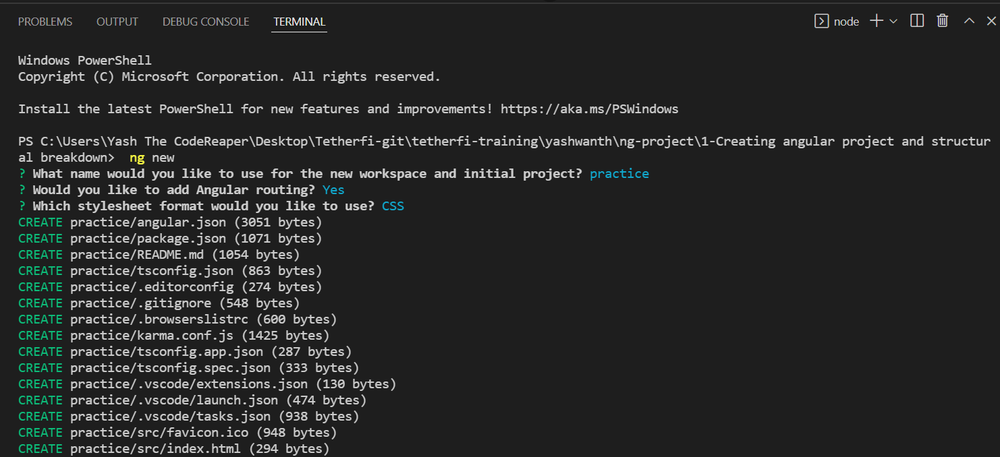
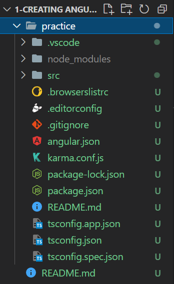
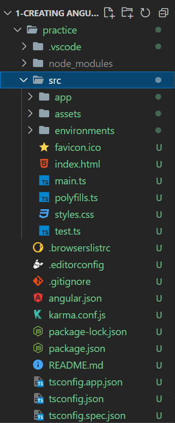
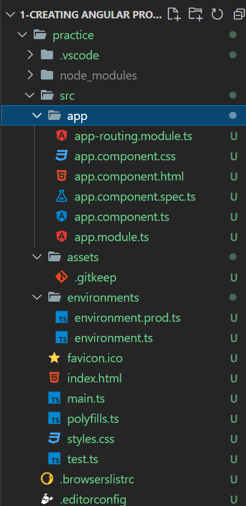
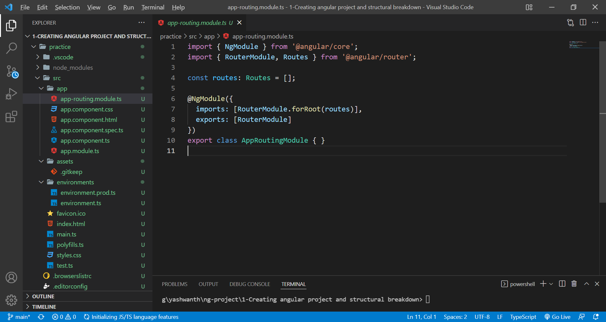
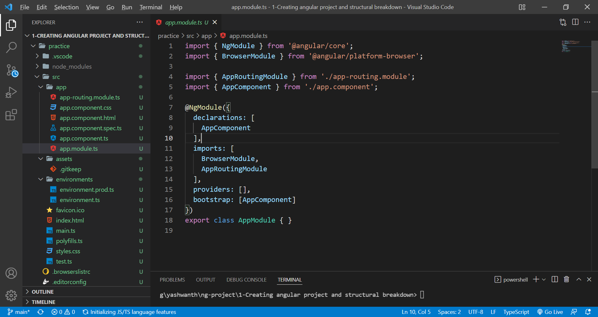
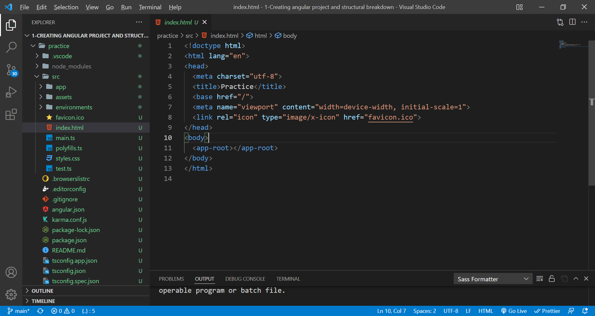
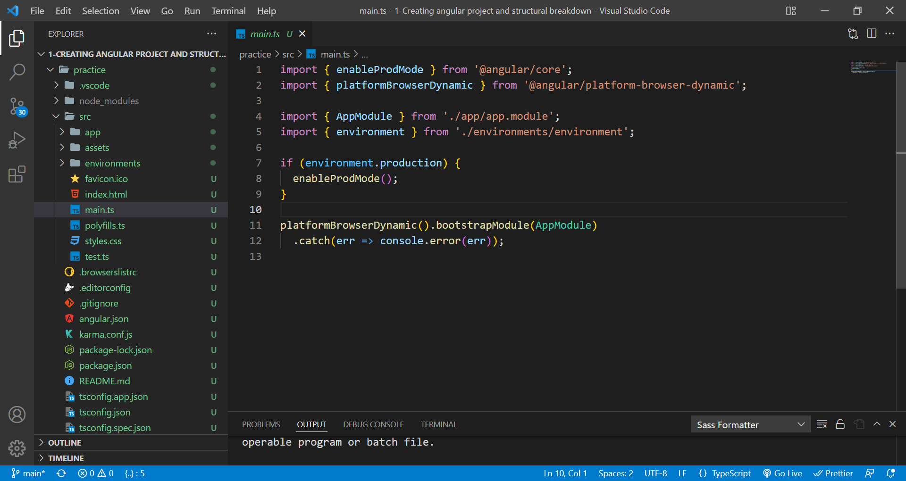
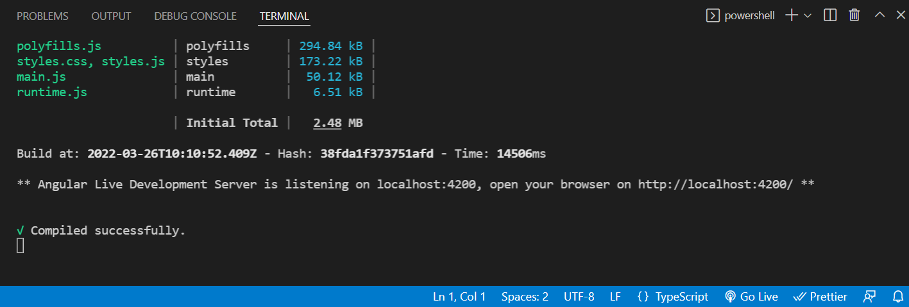
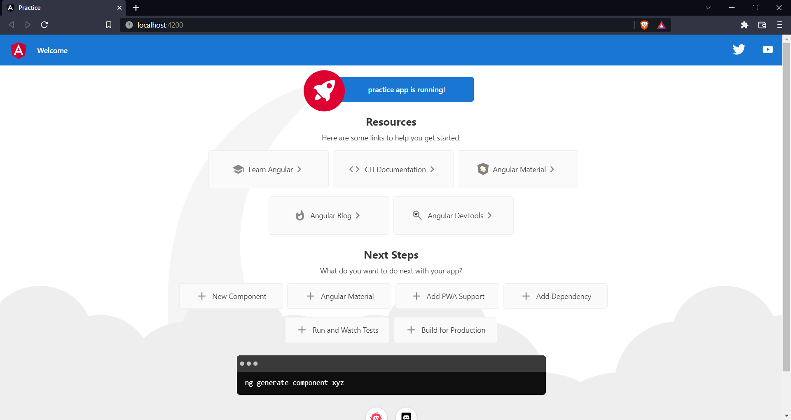

# creating angular project and structural breakdown

1-What is Angular?

Angular is a platform and framework for building single-page client applications using HTML and TypeScript. Angular is written in TypeScript. It implements core and optional functionality as a set of TypeScript libraries that you import into your applications.

1-Why use Angular?

Use Angular when you need to design web apps for all kinds of environments, especially:

-**Dynamic web apps:** Where the content and some components are displayed according to the user who is accessing and the client (web or mobile) that is consuming.

-**Business-level web apps:** Thanks to Typescript, you can design applications by reusing components and different modules. Also, with the wide variety of libraries, you can save a lot of work during the project.

-**Single-page apps/progressive web apps (SPA/PWA):** If you need to design minimalist but highly dynamic apps, Angular is the answer.

3-How to install Angular?

npm install -g @angular/cli

4-How to create Angular Project?

ng new

Fresh Project Structure:

5-What are those things created upon running ng new?

src folder(where our project content resides):

app folder(root component of angular app inside which other components are places),
assets folder(resources used by the app as a whole),
environments folder(the base configuration file, environment.ts , which provides a default environment. You can add override defaults for additional environments, such as production and staging, in target-specific configuration files.)

app-routing.module.ts(contains route urls and component selection upon routing of the angular application):

app.module.ts(every Angular application has at least one NgModule class, the root module, which is conventionally named AppModule and resides in a file named app.module.ts. You launch your application by bootstrapping the root NgModule.)

ng-decorators(An Angular Decorator is a function, using which we attach metadata to a class, method, accessor, property, or parameter. We apply the decorator using the form @expression , where expression is the name of the decorator)

index.html(root/main html file of the angular app, everything we created in src app will finally gets compiled here)

main.ts(Production mode can be configured in here. In main.ts file last line platformBrowserDynamic().bootstrapModule(AppModule) responsible for bootstraping of angular application. platformBrowserDynamic() part of this line indicates that we are about to boot Angular in a browser environment.)

ng serve(to run angular app in browser during development)

angular on browser(default html and css predefinded upon running ng new)

Author:
Yashwanthkumar Arivazhagan.