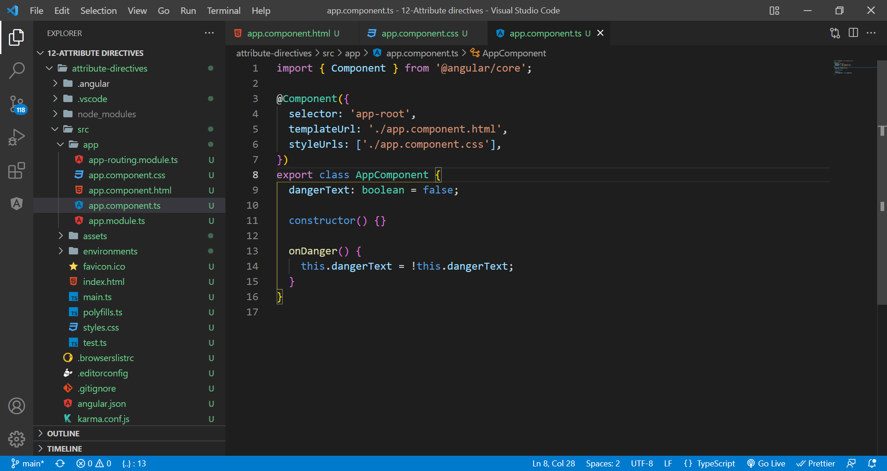
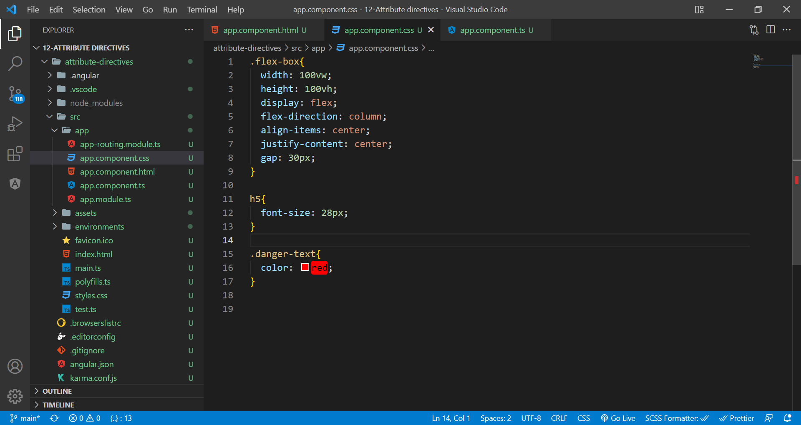
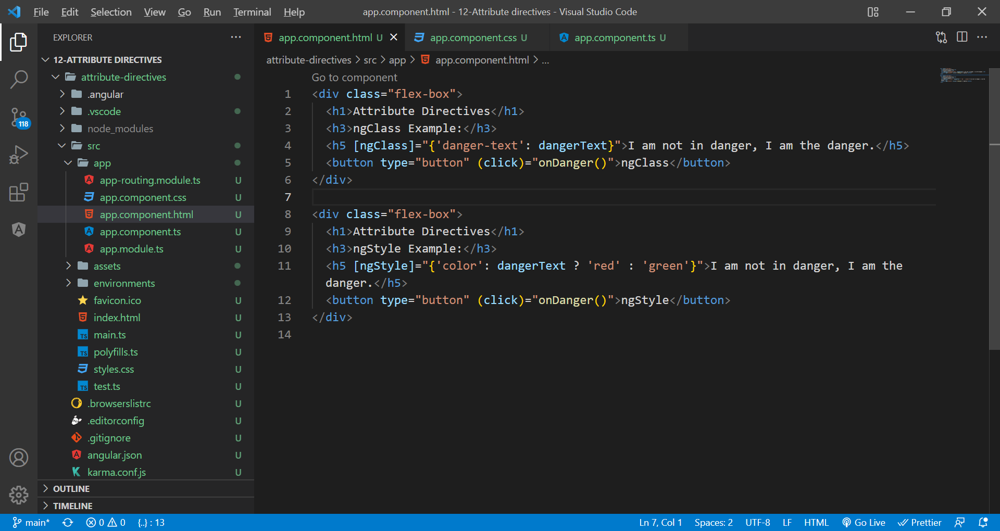
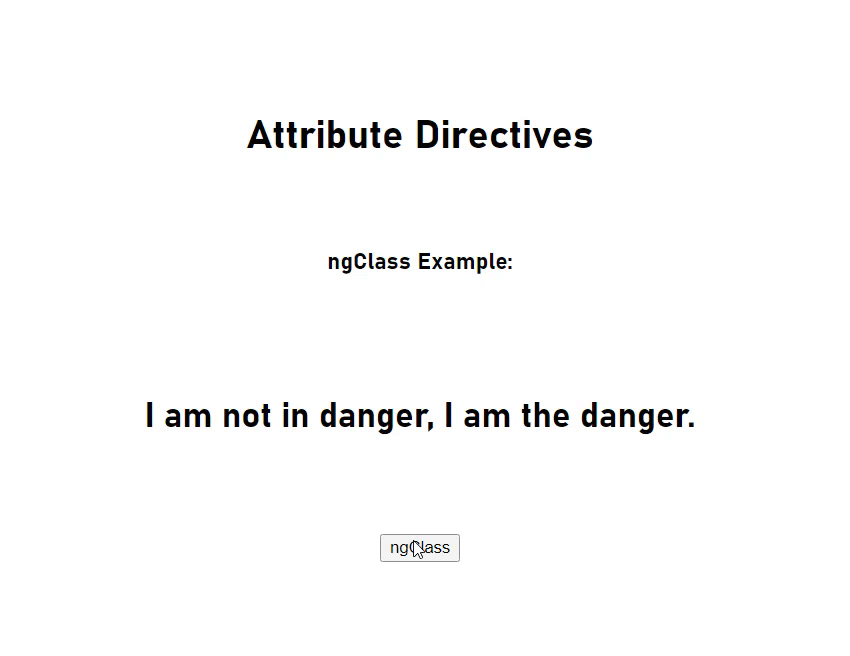

# attribute directives

The attribute directive changes the appearance or behavior of a DOM element. These directives look like regular HTML attributes in templates.

Examples: ngClass, ngStyle, ngModel etc.

Delcare the boolean variable in the component.ts

Declare the css properties

[ngClass]="{'classname': boolean}"
[ngStyle]="{'attribute': ternary value}"

