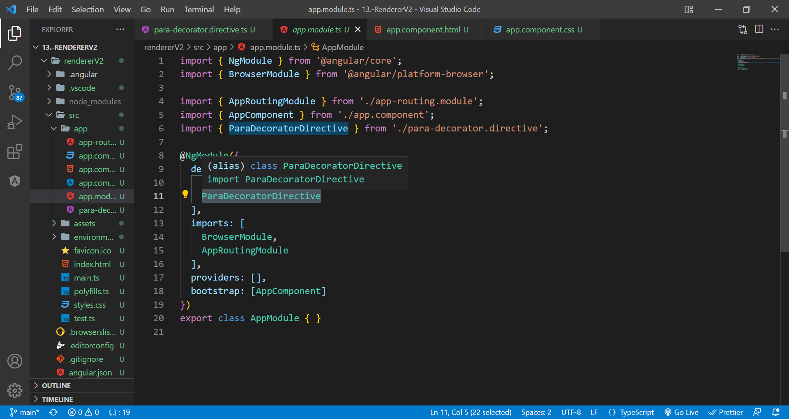

# rendererV2

The Renderer2 class provided by Angular in the form of a service that allows to manipulate elements of your app without having to touch the DOM directly.

Generate a new directive(ng g d paraDecorator) and delcare and assign the css properties to the element reference shown as below.

Make sure it is imported in the declarations of ngModule in app.component.ts.

Create a paragraph.

Paragraph now has no stylings coz we are not using our custom attribute directive with renderer2.

Now use the directive as shown below(it should be same as the selector of the directive).

Paragraph after using our custom attribute directive with renderer2.
