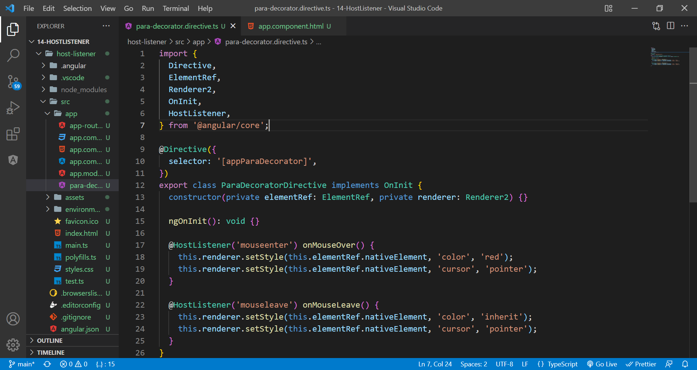

# host listener

Decorator that declares a DOM event to listen for, and provides a handler method to run when that event occurs.

Generate a new directive(ng g d paraDecorator). Follow the below syntax and delcare @HostListener and alter the element reference's style.

Make sure that it is imported in the declarations of ngModule of app.component.ts.

Add the directive to the paragraph.

