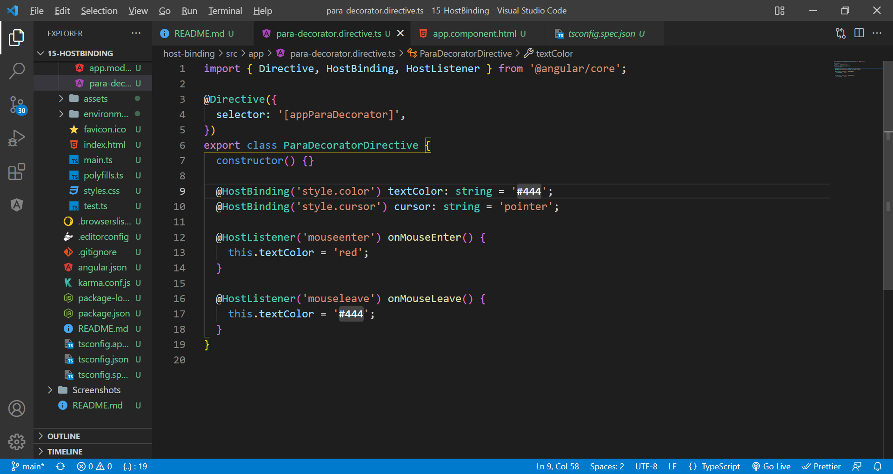

# host binding

HostListener listens to host events, while HostBinding allows us to bind to a property of the host element. The host is an element on which we attach our component or directive. This feature allows us to manipulate the host styles or take some action whenever the user performs some action on the host element.

Everythings the same, except HostBinder does not use ElementRef or RendererV2.

The process of using is also same, except some syntax, which u can refer below.
@HostBinder('property') variable: dataType = value;
