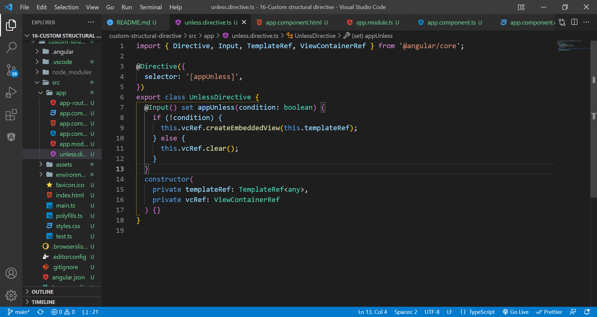
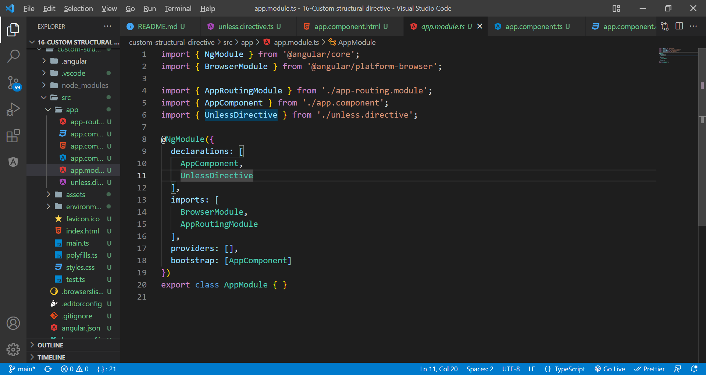
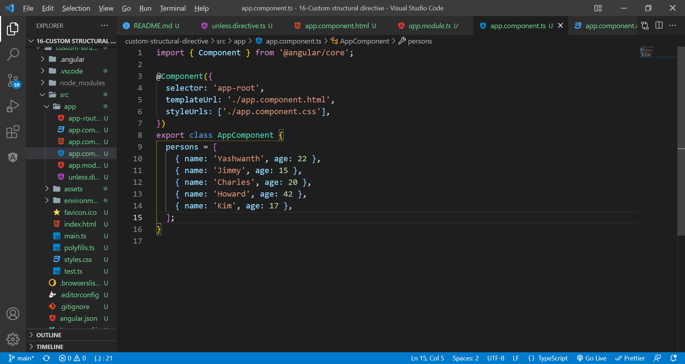
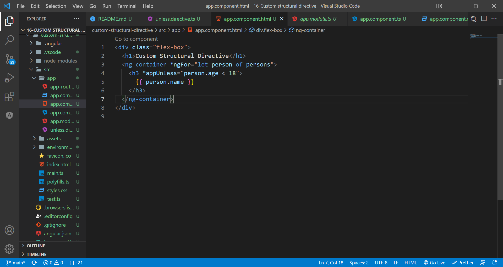
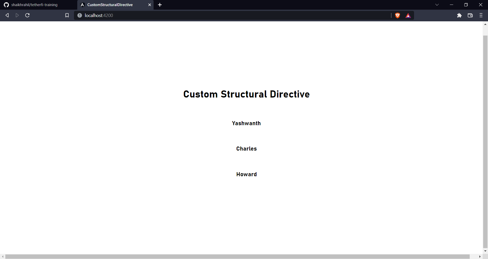

# custom structural directive

Lets learn how to build our own structural directive.

Generate a driective(ng g d unless). Basically, we are gonna create a directive, which accepts a boolean as a property and render the element into ng container if it is not true(opposite of *ngIf).

Make sure it is imported in the declarations of @NgModule of app.component.ts.

Declare an array of objects.

Use the directive in html as shown.

