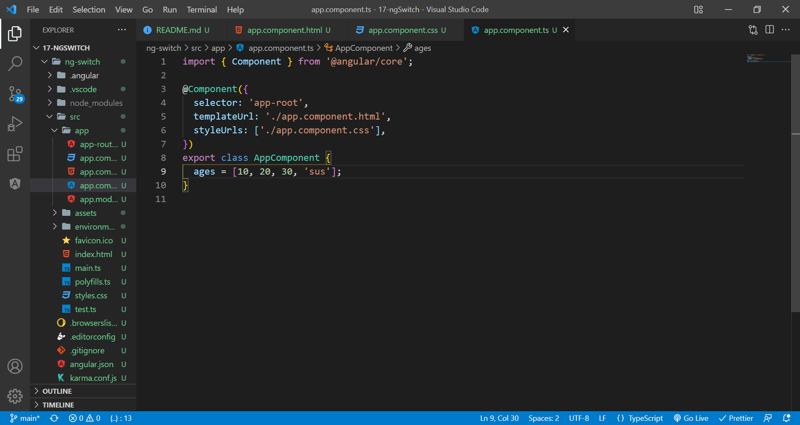
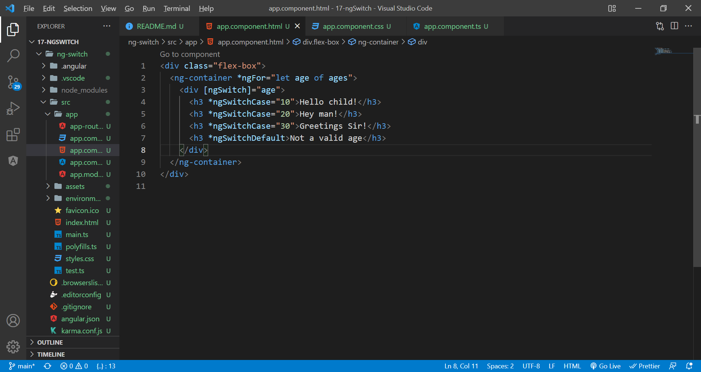
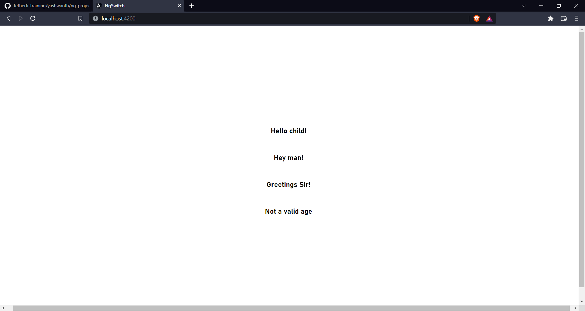

# ngSwitch

The ng-switch directive lets you hide/show HTML elements depending on an expression. Child elements with the ng-switch-when directive will be displayed if it gets a match, otherwise the element, and its children will be removed or shown a default value.

Delcare the variable in component.ts.

Use ngSwitch as below.

