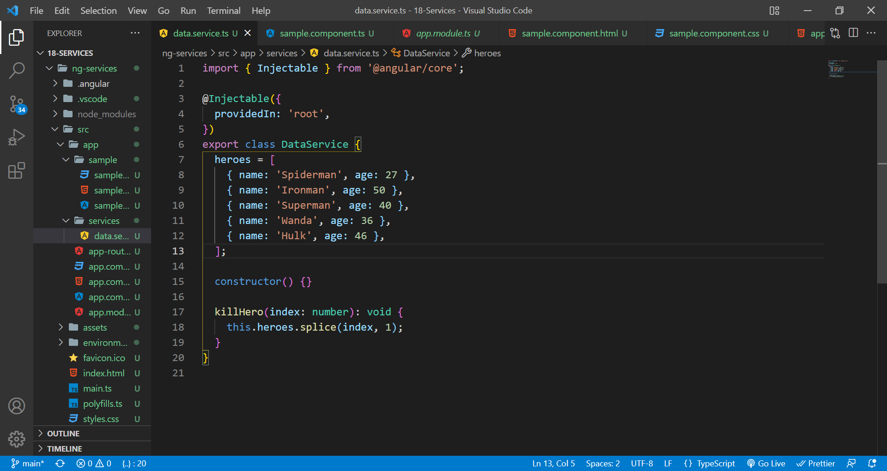
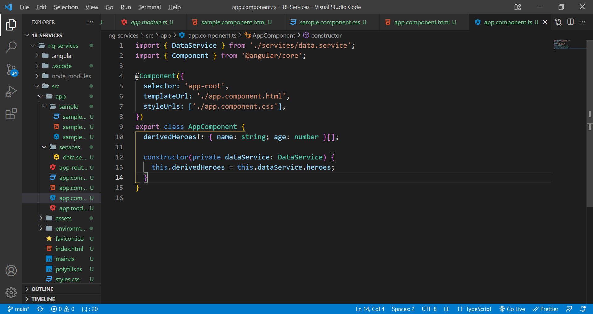
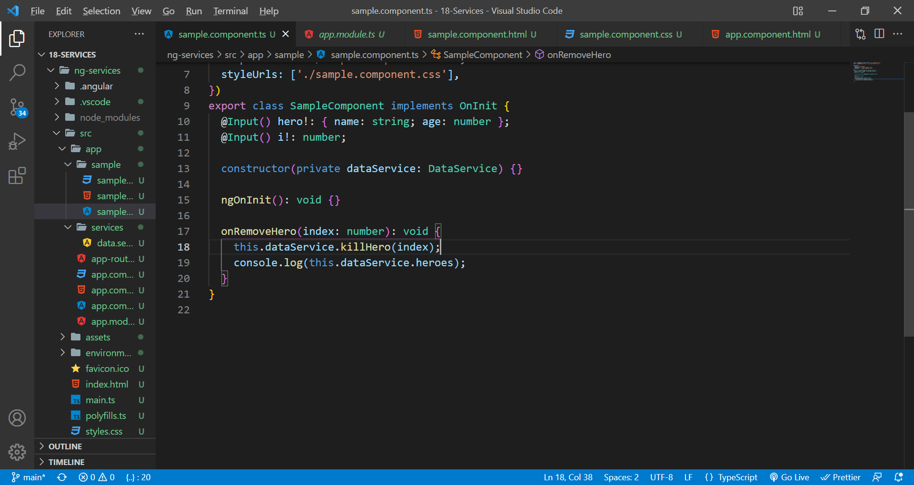
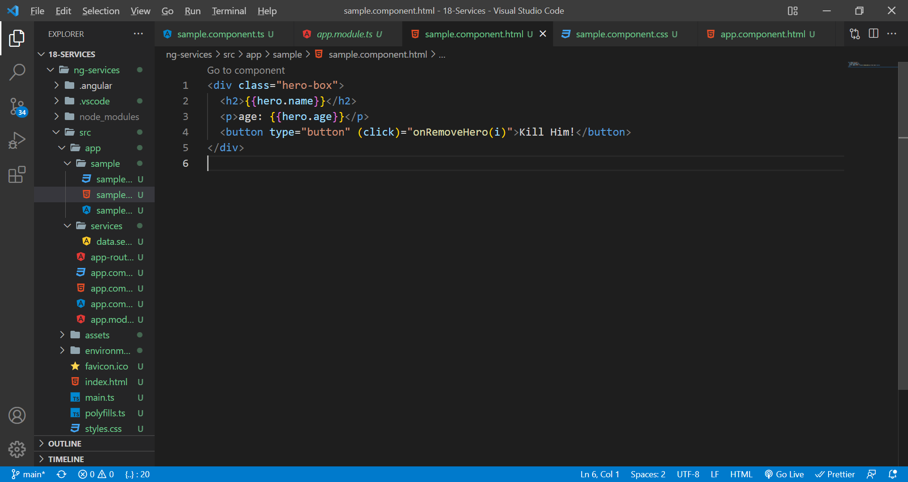
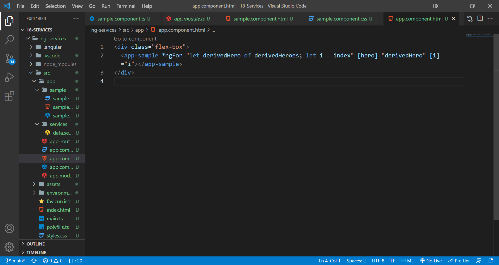

# angular services

Angular services are objects that get instantiated just once during the lifetime of an application. They contain methods that maintain data throughout the life of an application, i.e., data is available all the time.
Its like a centralized data station that every component has access to and if any changes made to the data in the services by one component get reflected in every other ones.

Generate a service(ng g s services/data), and add some data and methods. Provide it in root so that all components including app root can have access for it.

In app.component.ts get the data from the service as shown below.

Generate a component(ng g c sample). In the sample.component.ts, use the service and the required methods from the service.

Using 2-way binding, bind the data.

Now, the changes made will gets reflected in both.
