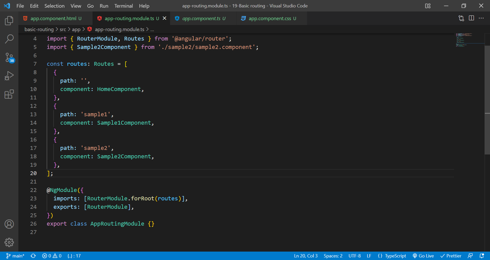
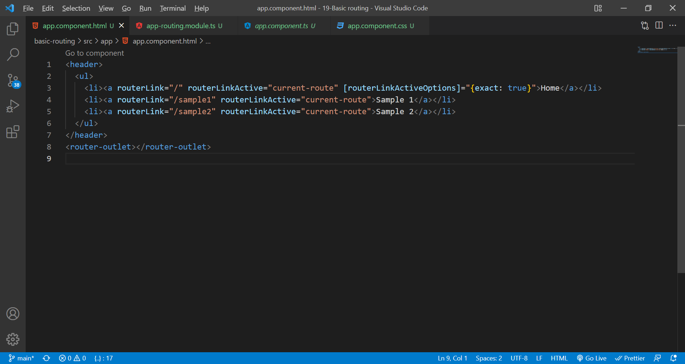
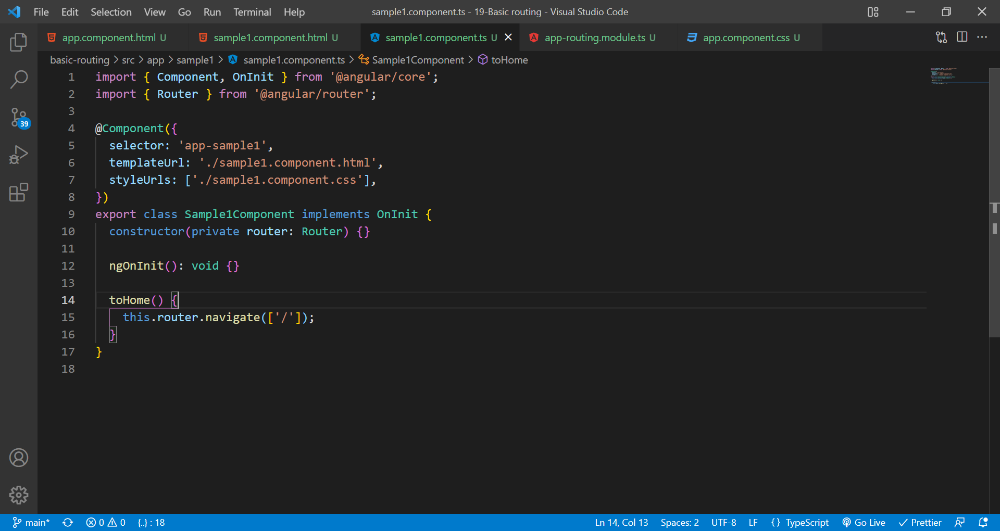

# basic routing in angular

Angular provides extensive set of navigation feature to accommodate simple scenario to complex scenario. The process of defining navigation element and the corresponding view is called Routing. Angular provides a separate module, RouterModule to set up the navigation in the Angular application.

Here, path is the url from the root, component is to specify which component to be loaded on that url.

**Router link:**In Angular, RouterLink is a directive for navigating to a different route declaratively. Router. navigate and Router. navigateByURL are two methods available to the Router class to navigate imperatively in your component classes.

**Router link active:**The RouterLinkActive is a directive for adding or removing classes from an HTML element that is bound to a RouterLink . Using this directive, we can toggle CSS classes for active Router Links based on the current RouterState . The main use case of this directive is to highlight which route is currently active.

We can also programatically route as shown below. If u wanna use relative url, you should import ActivatedRoute and use an object {relativeTo: this.activatedRoute} next to the url.

