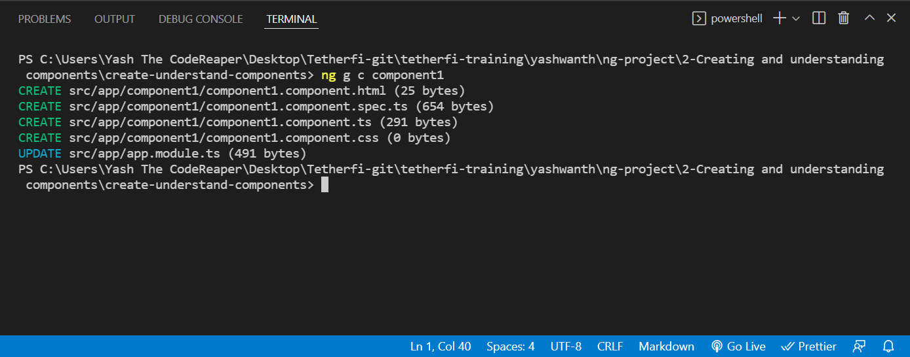
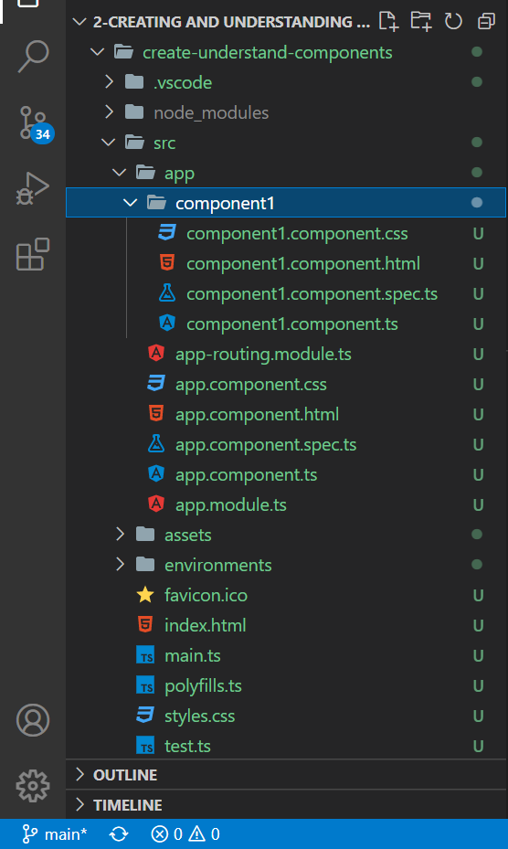
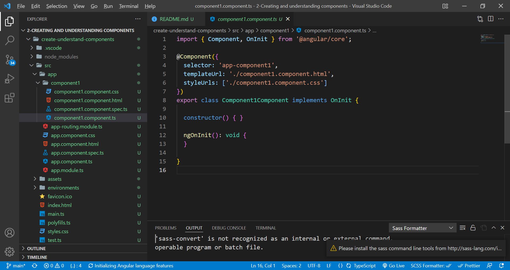
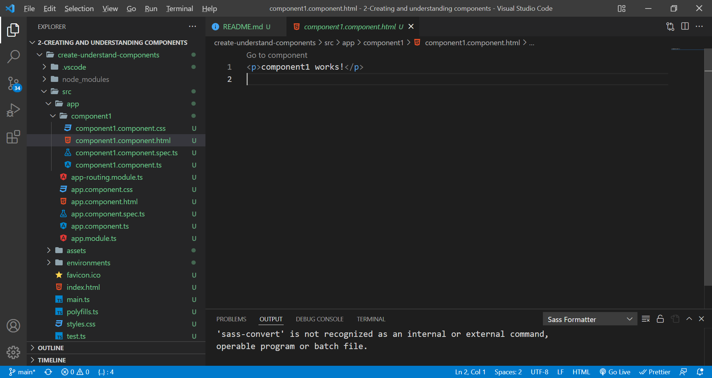
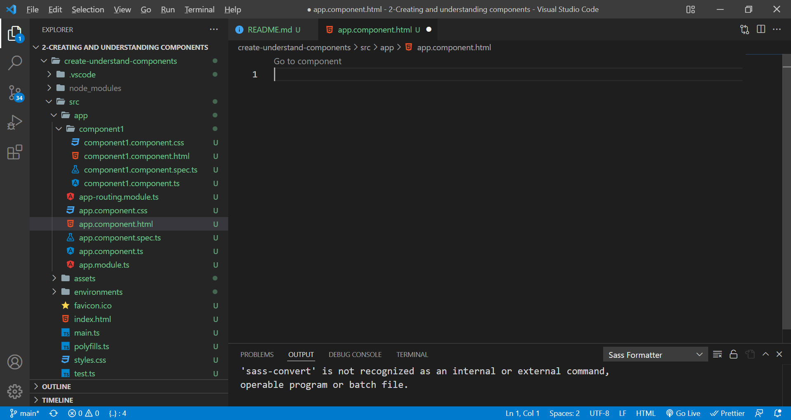
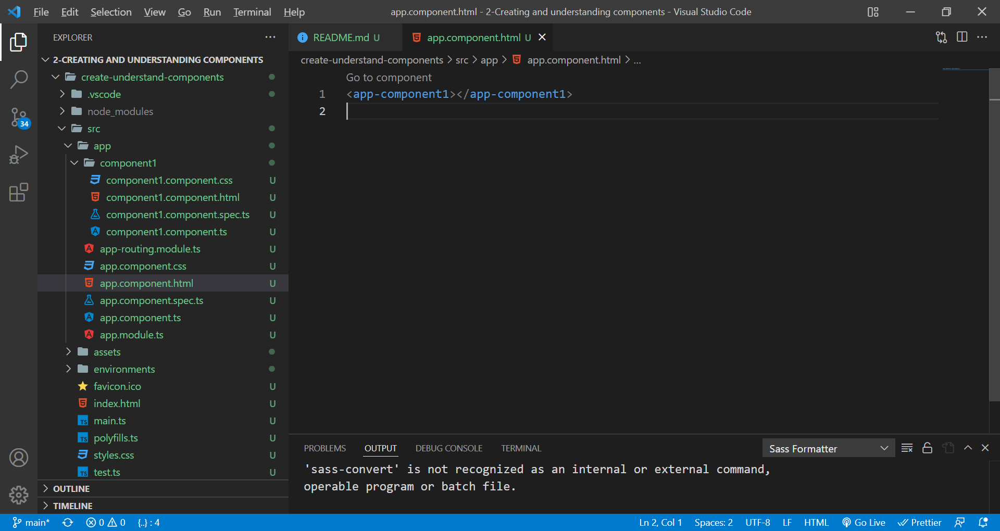
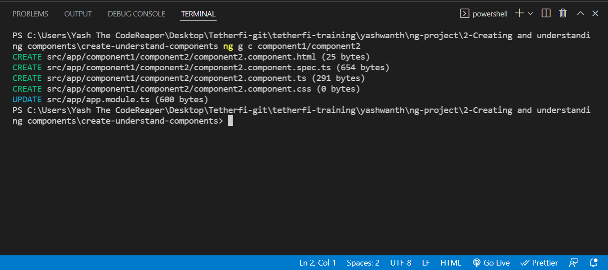
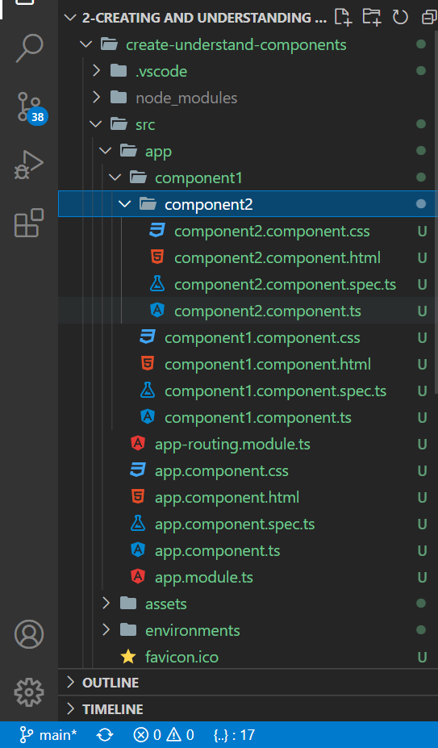
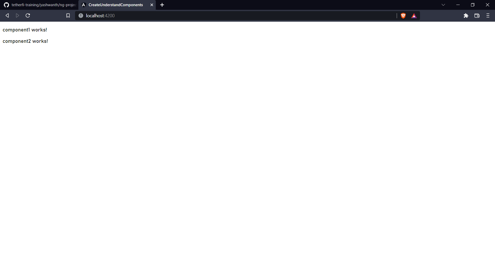

# creating and understanding components.

1-What are Angular Components?

A Component is nothing but a simple typescript class, where you can create your own methods and properties as per your requirement which is used to bind with an UI (html or cshtml page) of our application.

2-How to create Angular Components?

ng g c component_name

Note: A component should be generated inside the project directive.

By default, components are generated inside app directive

3-Components Overview

component.component.ts(It contains all the metadata about the component. selector declaration is important because when we want to implement this component in the root app component or in some other component, we're gonna do that using this selector. templateUrl is the link for html file. styleUrls contains an array of url links(mainly css, sometimes sass/scss))

Html file of the component

Html file of the root app component

Using component1 inside app component(using selector of the component1)

Genereting component in a specific folder

Upon ng serve:
