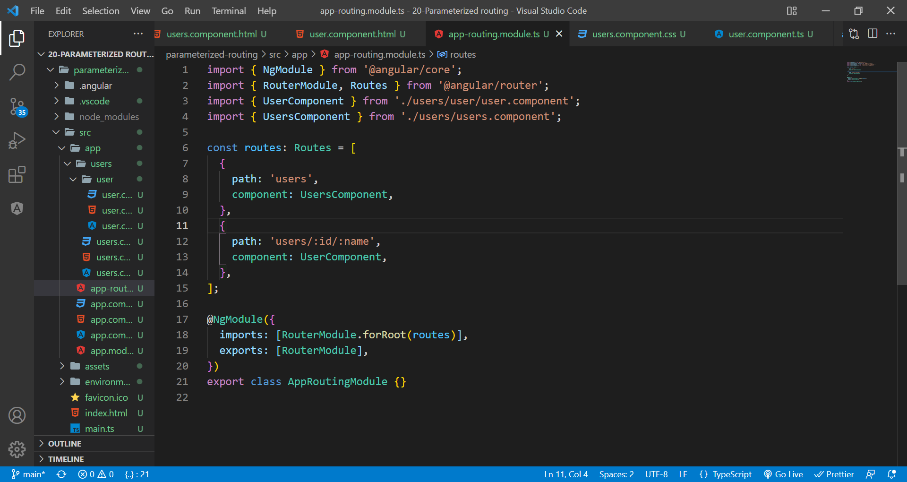
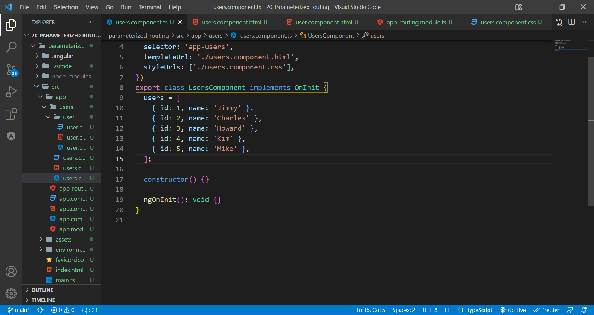
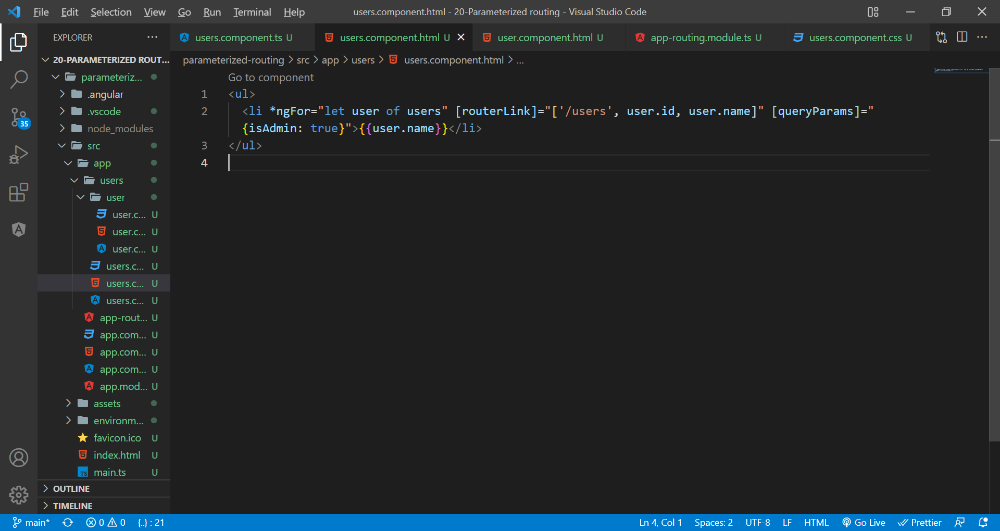
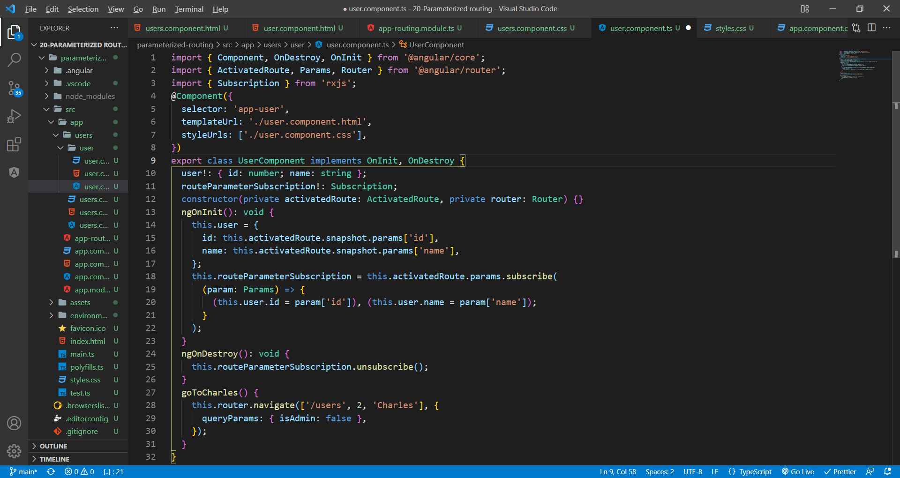
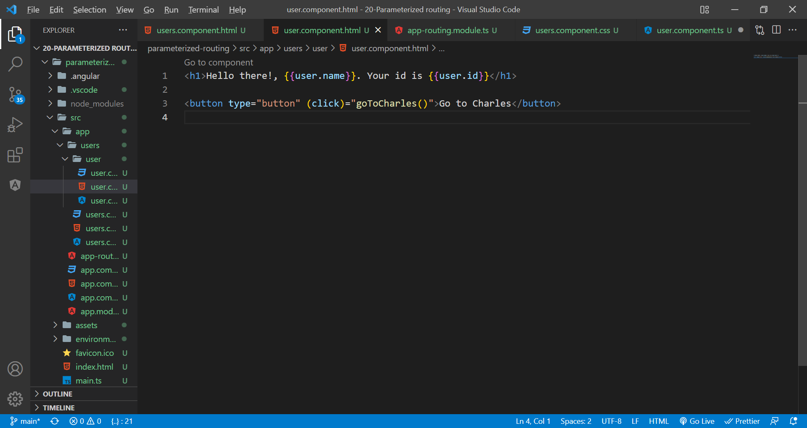

# injecting parameters in routing

To access the route parameters, we use route. snapshot , which is the ActivatedRouteSnapshot that contains information about the active route at that particular moment in time.

Create components. Declare routes. For injecting parameter use :parameterName.

Declare some random array and assign some value.

For each element in the array, append the routerLink and queryParams as shown below.

Access the route parameters as shown below. We will see more about subscriptions. But for now, imagine them as some service providers and they provides data updates frequently...like web sockets.
In order to prevent memory leak, unsubscribe at the component ngOnDestroy. We are using observable because we need to change the route here asynchronously(pressing a button).

User component's html.

Final result!
