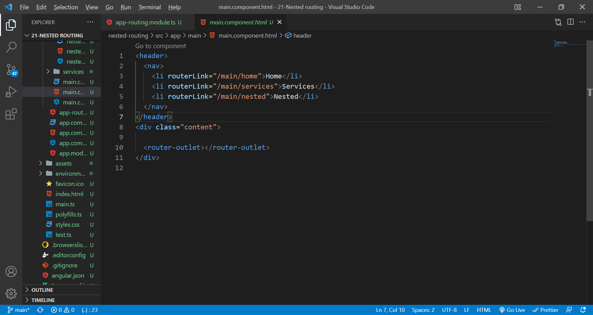

# nested routing in angular

You can create a nested routing by defining child routes using the children property of a route (alongside a path and component properties). You also need to add a nested router-outlet in the HTML template related to the component linked to the parent route.

Define the routes and child routes(in children).

Make necessary selector placing in the components.

