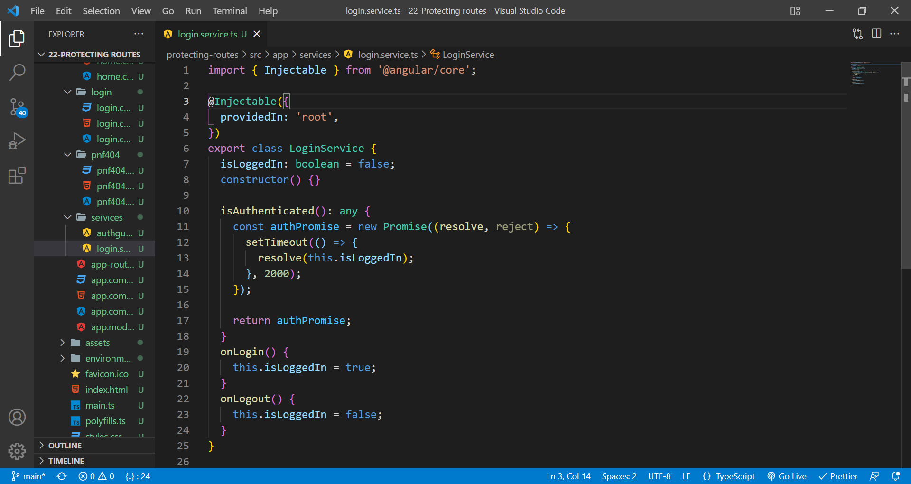
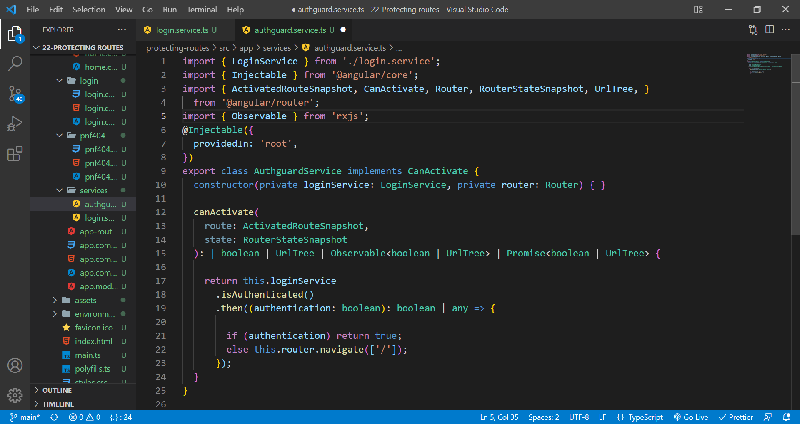
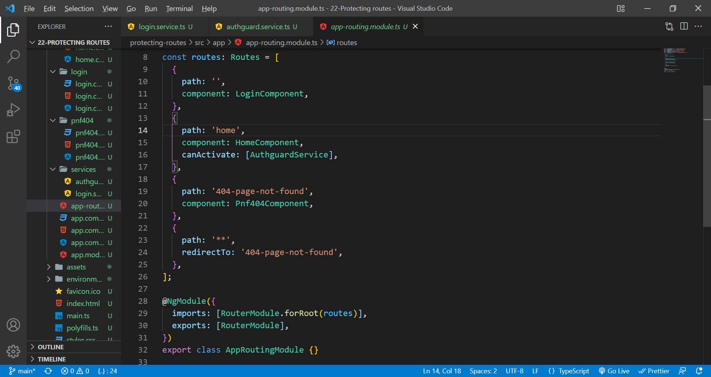

# protecting routes

The Angular CanActivate guard decides, if a route can be activated ( or component gets rendered). We use this guard, when we want to check on some condition, before activating the component or showing it to the user. This allows us to cancel the navigation.

Login service.

Authguard service using canActivate(we can also use canActivateChild to protect child components)

App routing module and canActivate in home component. To handle invalid routes, use redirectTo.

