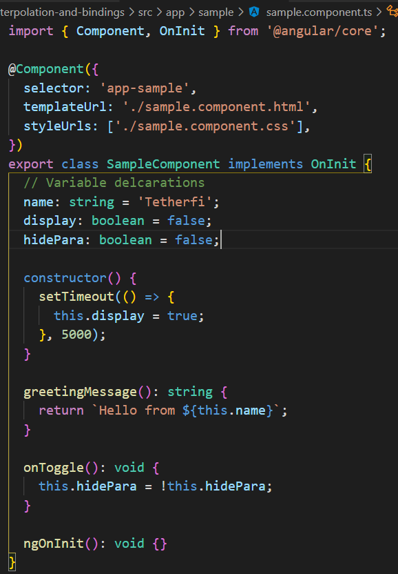
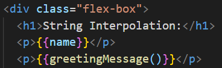
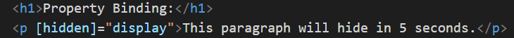
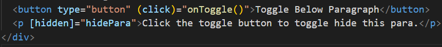
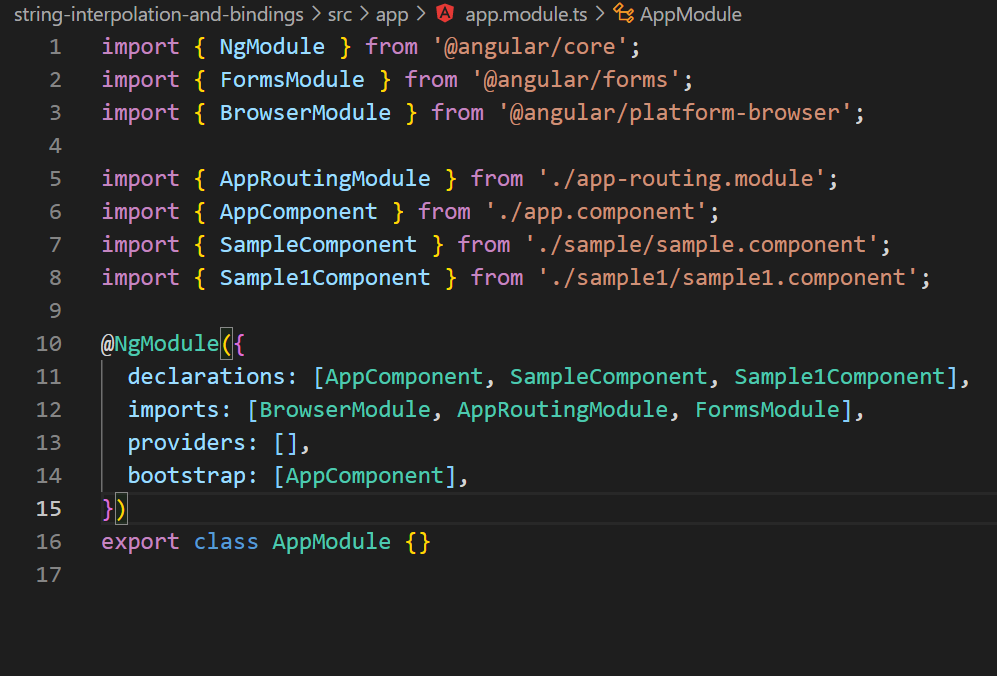
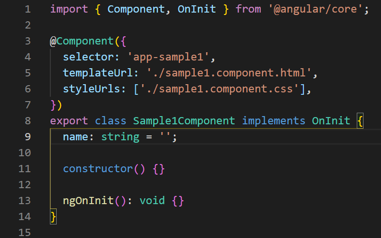
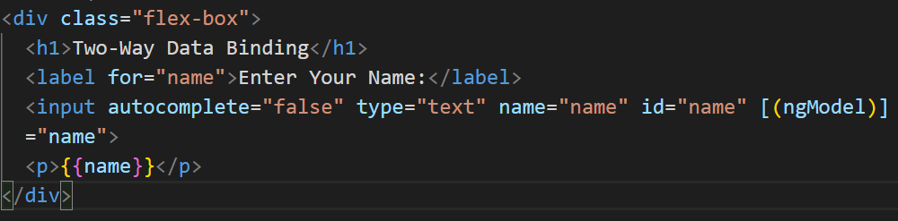
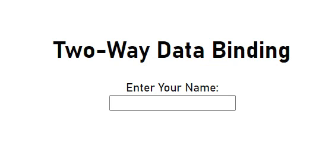

# string interpolation, property binding and event binding

1-What is Data Binding?

Data binding is a core concept in Angular and allows to define communication between a component and the DOM, making it very easy to define interactive applications without worrying about pushing and pulling data.

2-What is One-Way Data Binding?

One-way data binding in Angular (i.e. unidirectional binding) is a way to bind data from the component to the view (DOM) or vice versa - from view to the component. It is used to display information to the end-user which automatically stays synchronized with each change of the underlying data.

3-What is Two-Way Data Binding?

The two-way data binding in Angular enables data to flow from the component to the view and the other way round. It is used to display information to the end-user and allows them to make changes to the underlying data using the UI.

**One-Way Data Binding:**

sample.component.ts

***String Interpolation:***
String Interpolation in Angular is a one-way data-binding technique that is used to transfer the data from a TypeScript code to an HTML template (view). It uses the template expression in double curly braces to display the data from the component to the view.

***Property Binding:***
Property binding in Angular helps you set values for properties of HTML elements or directives. Use property binding to do things such as toggle button functionality, set paths programmatically, and share values between components.

***Event Binding:***
Event binding lets you listen for and respond to user actions such as keystrokes, mouse movements, clicks, and touches.

**Two-Way Data Binding**

As we are going to work with forms, import FormsModule in app.module.ts

In component.ts file, declare the variable

So, 2way DB, alters and displays the variable while in 1way DB, it only views it.

Author: Yashwanthkumar Arivazhagan.