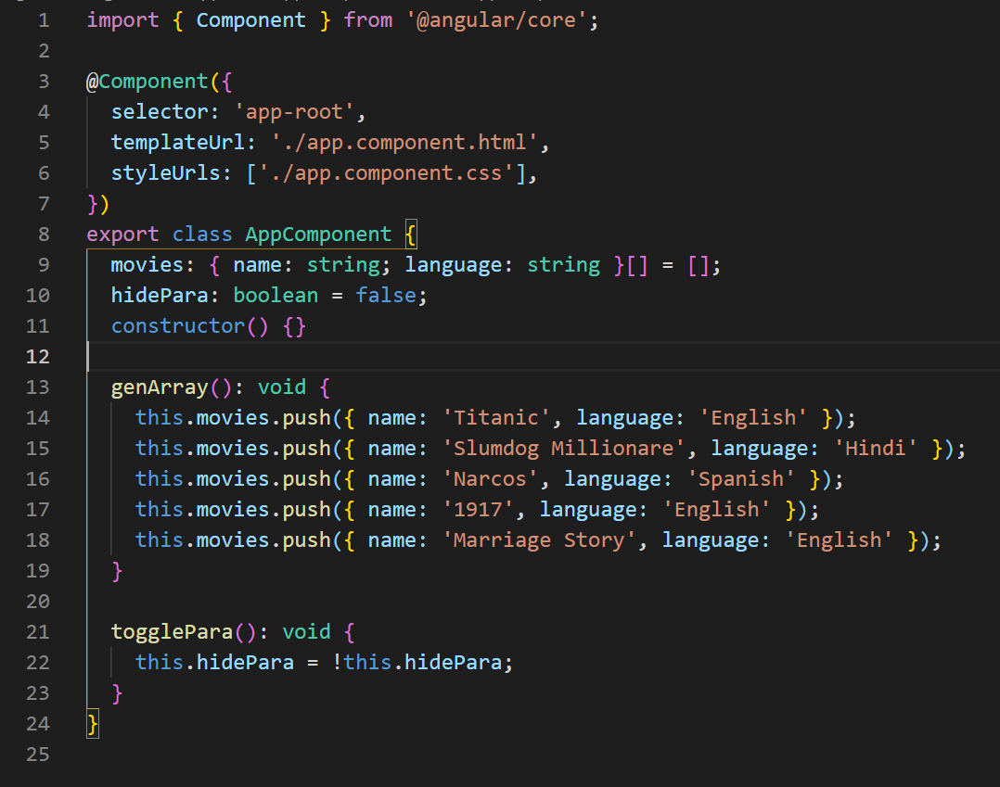
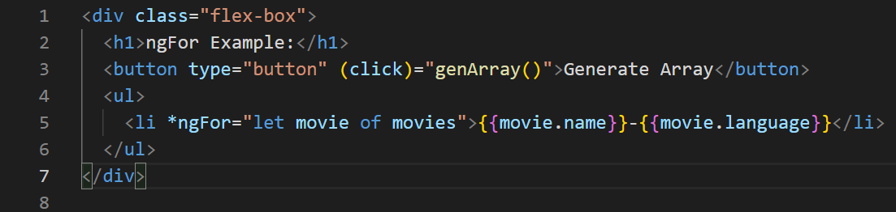
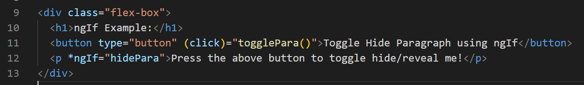
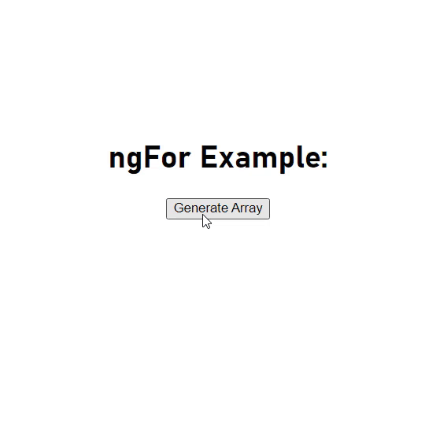
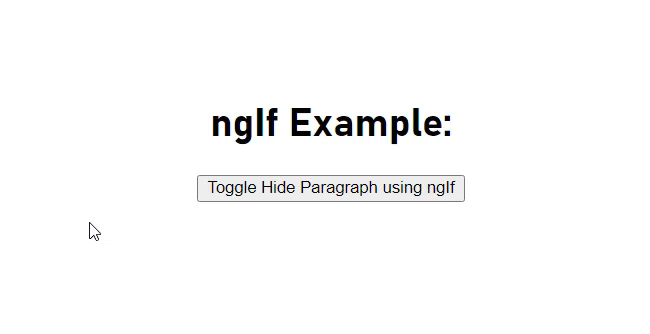

# ngFor and ngIf

1-What is ngFor?

*ngFor is a predefined directive in Angular. It accepts an array to iterate data over atemplate to replicate the template with different data. It's the same as the forEach() method in JavaScript, which also iterates over an array.

2-What is ngIf

The ngIf directive removes or recreates a portion of the DOM tree based on an {expression(boolean)}.

Define the variables in component.ts file

using ngFor:

using ngIf:

ngFor result:

ngIf result:
