# property binding and event binding between components

**Property Binding:**
    Its is a method which is used to send data to other component as a property of that component.

Example:

Delcare heroElement Array with some values in the app.component.ts(the component from which u need to send data)
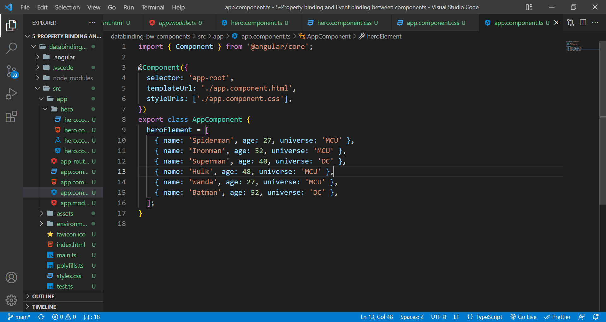

For every element in heroElement array, generate hero component(using ngFor)
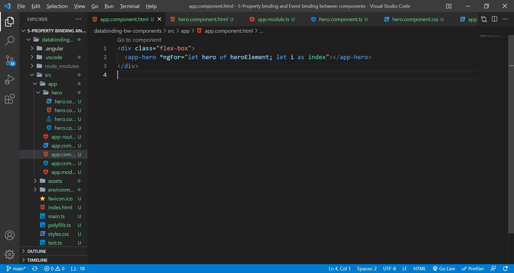

In hero component, delcare the object(which is of type element of heroElement array) and index as i
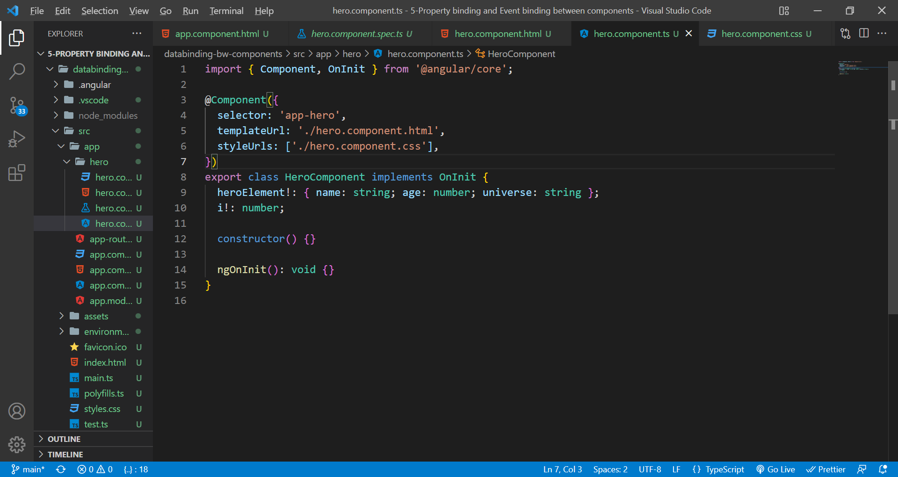

Using string interpolation, display the data.
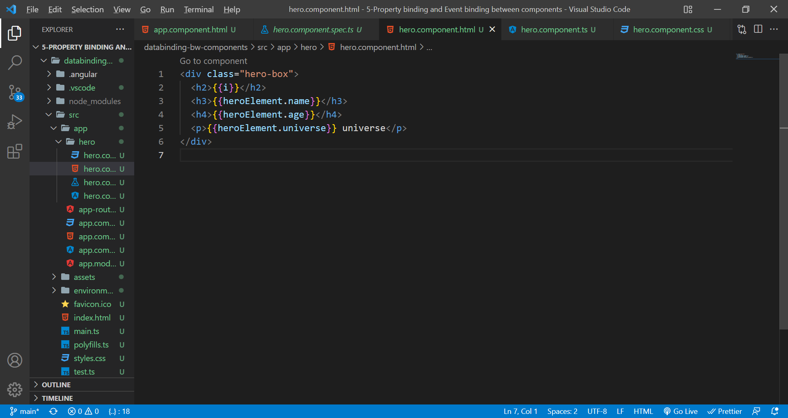

But...nothing happens, guess.....yeah, the data from app component(heroElement array) is not passing through hero component. So, basically it does create hero elements for heroElement.length number of times without passing the data. Hence, u see empty boxes.
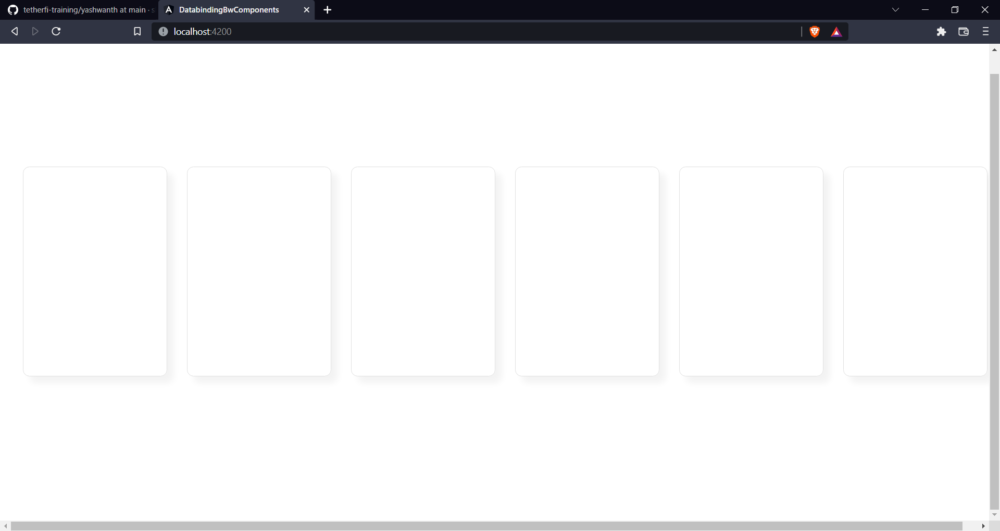

Now, its time to use property binding. Bind the hero property into the hero component using the below syntax. [data to send]="data variable in other component"
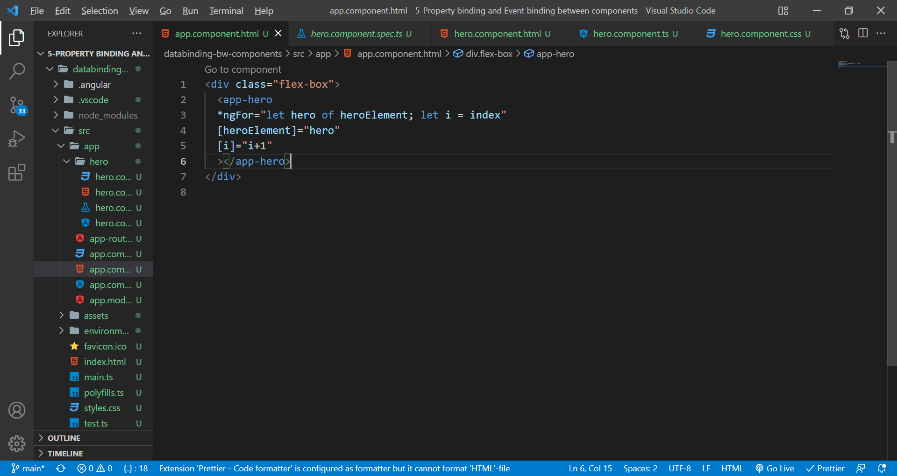

Now prefix the declared variables in hero component with @Input()(needs import from @angular/core).
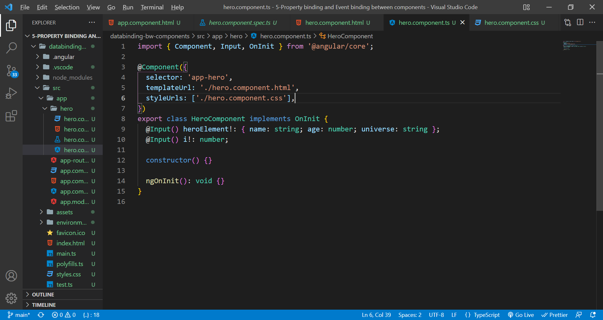

Boom....here u go, u've successfully passed data between components
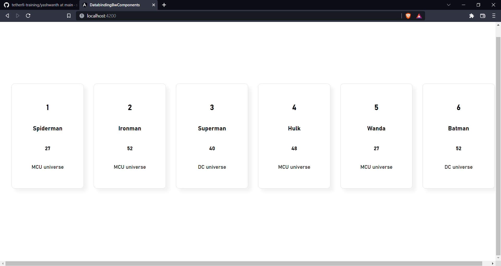

**Event Binding:**
    Imagine, u are clicking a button on one component. Upon that event, u have to make changes to some data in the other component. Well, say Chào cô to Event Binding.

Scenario: You have to remove the element from heroElement array, which resides in app component upon clicking a button on hero component. Lesse.

Declare function which accepts the index of the hero in heroElement array and splices it. It should be in app component because the data(heroElement array) is there.
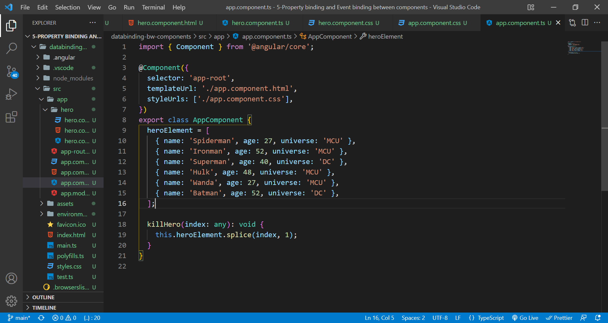

In hero component, create an event binding on button click which passes the index number.
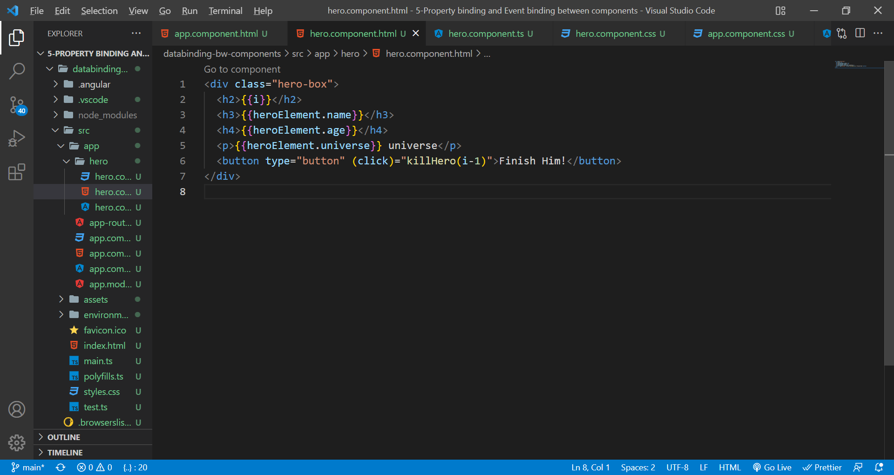

In hero.component.ts, you have to create a new EventEmitter which emits a number. EventEmitter emits data at top app level, which can be catched by other components or by itself. Create a function, which emitts the index number upon button click.
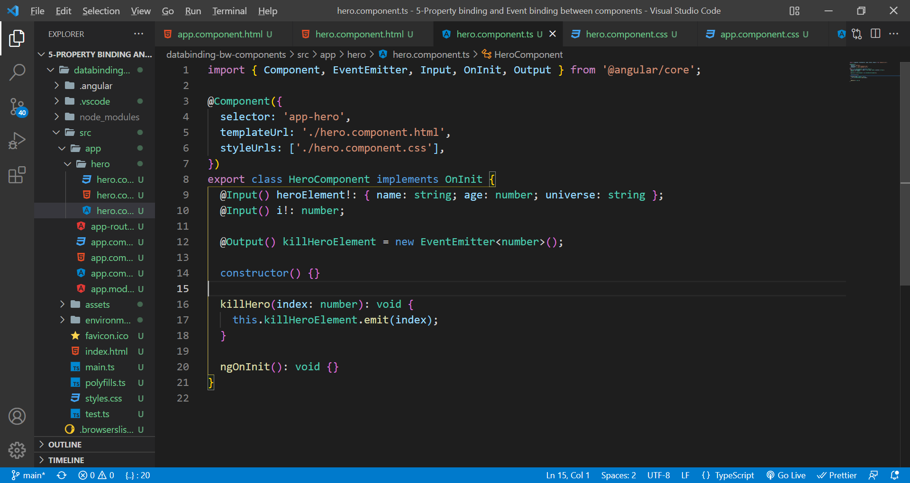

Use event binding now on the component selector. (eventEmitter name)="function to delete(event data)"
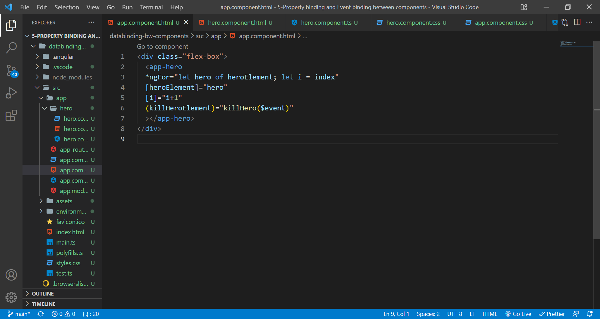

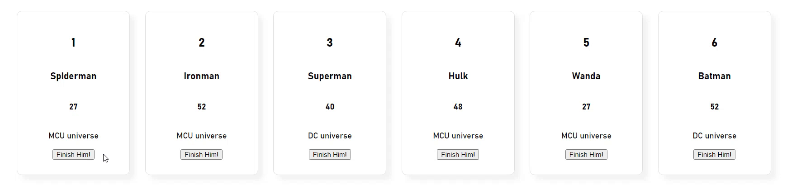