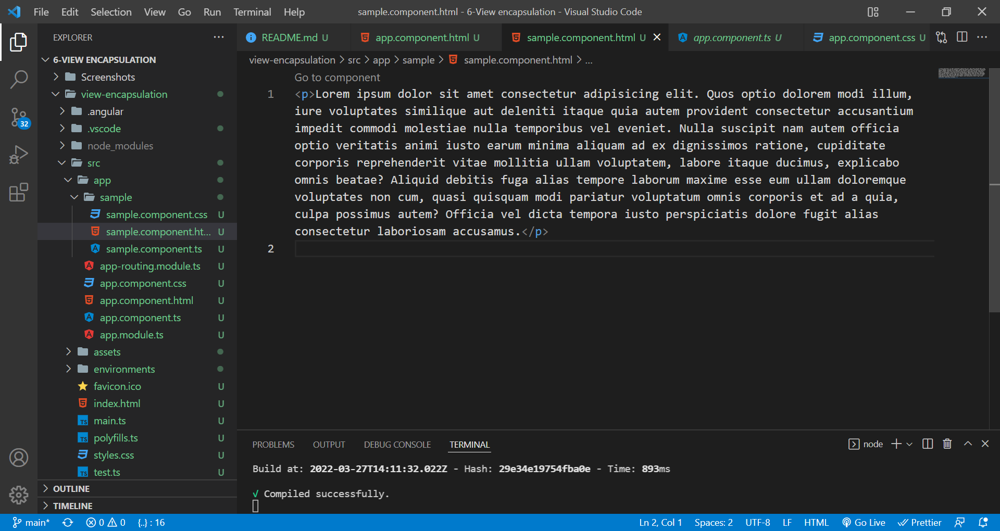
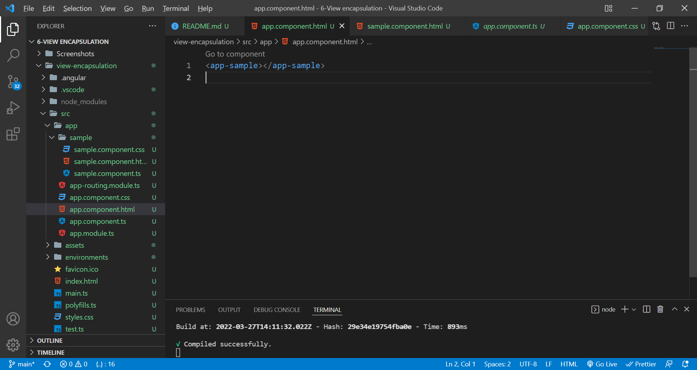
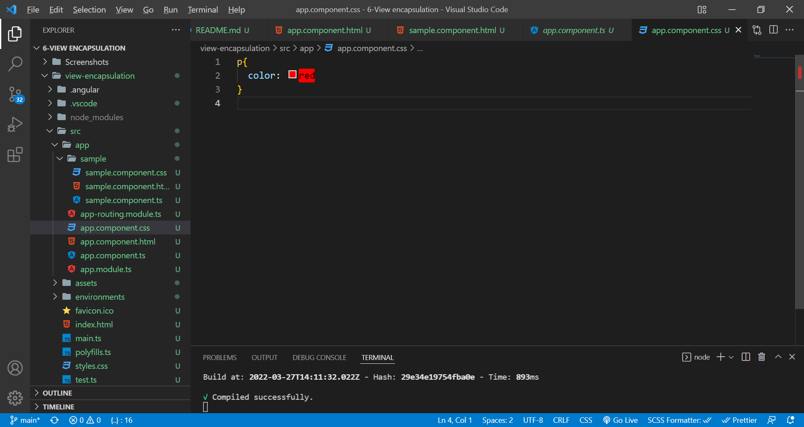
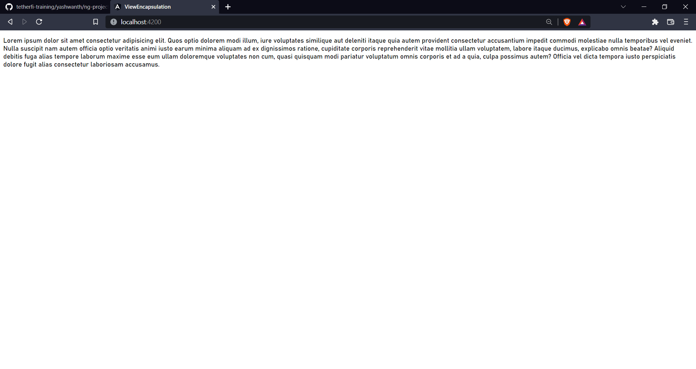
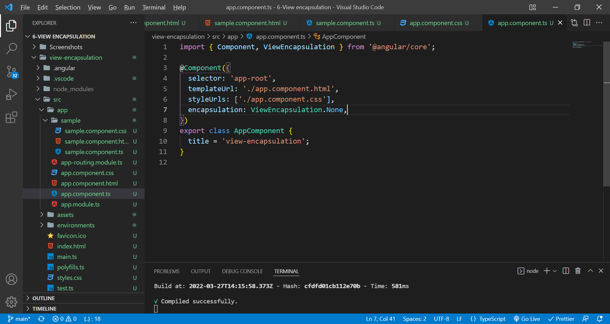
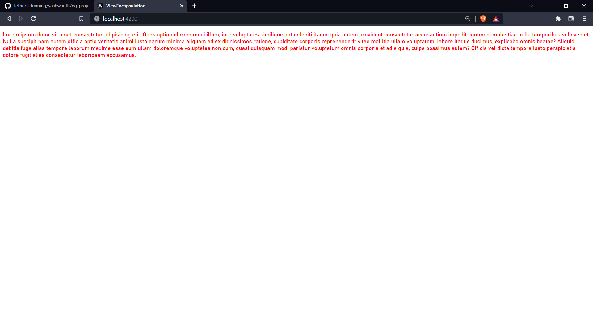

# view encapsulation

View encapsulation defines whether the template and styles defined within the component can affect the whole application or vice versa. Angular provides three encapsulation strategies: Emulated (default) - styles from main HTML propagate to the component.

Create a component called sample and type some paragraph.

Import that in app component.

In the css of app component, select the paragraph element and set the color property to red.

U didn't expect that right? Actually the css declarations does not traverse through other components(globally), but it belongs to the elements of the components itself(not even if the component has other components import)

If u need to apply css of the component globally, in the component.ts, to the @Component decorator, use encapsulation: ViewEncapsulation.None / ViewEncapsulation.ShadowDOM.

Now see the results,
