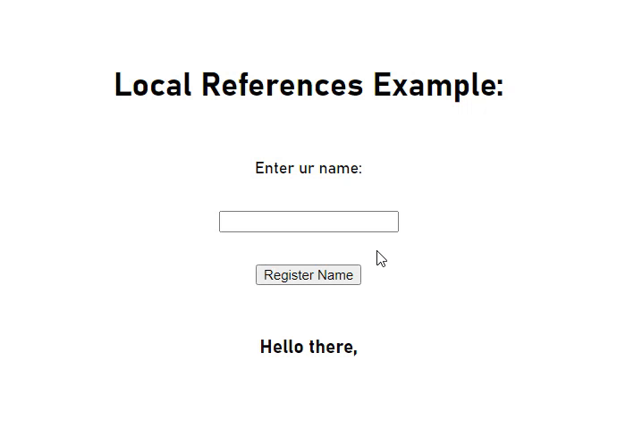

# local references

Instead of two-way binding, we can easily fetch a value of any input through local references in Angular. Local references can be fetched directly from the component template and into the component typescript class.

Declare the variable in the component.ts file

Declare the input element as local reference(using #) and pass it into the button click event as event binding

Now assign the value of that element to name variable and display it. We could have done the same with [(ngModel)], but this is an alternative and efficient way with forms.

