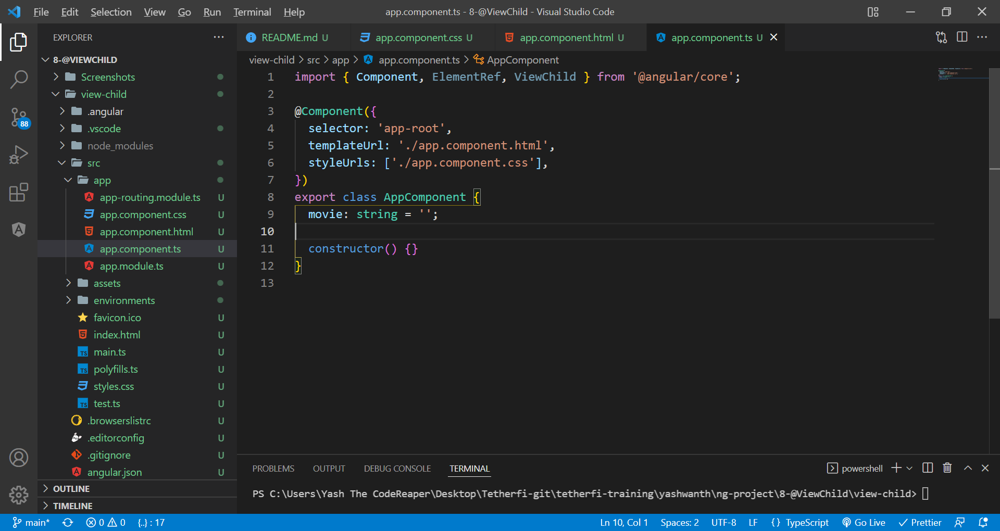
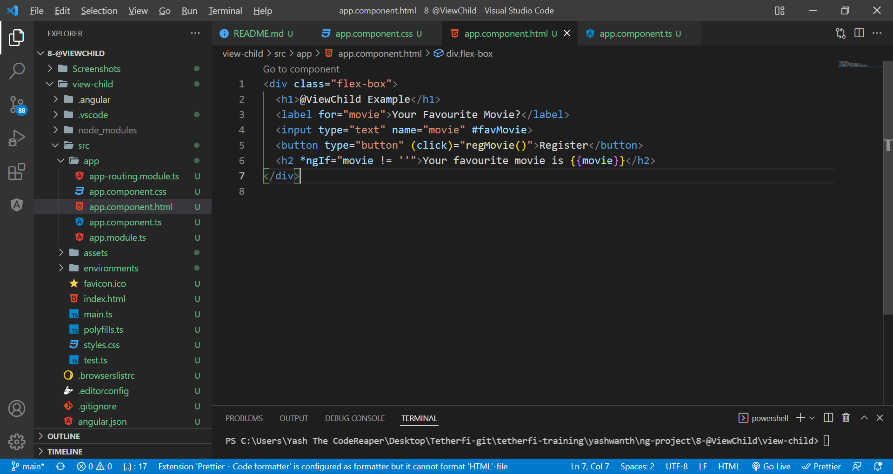
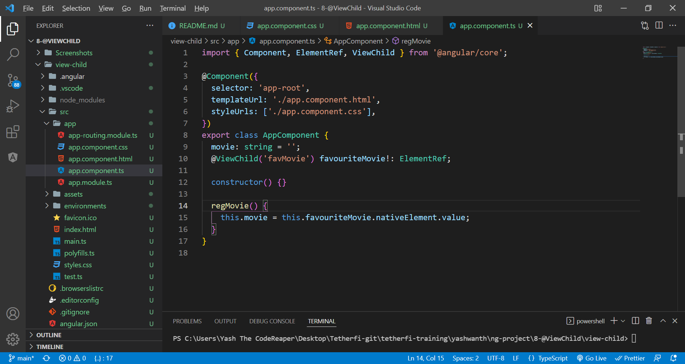
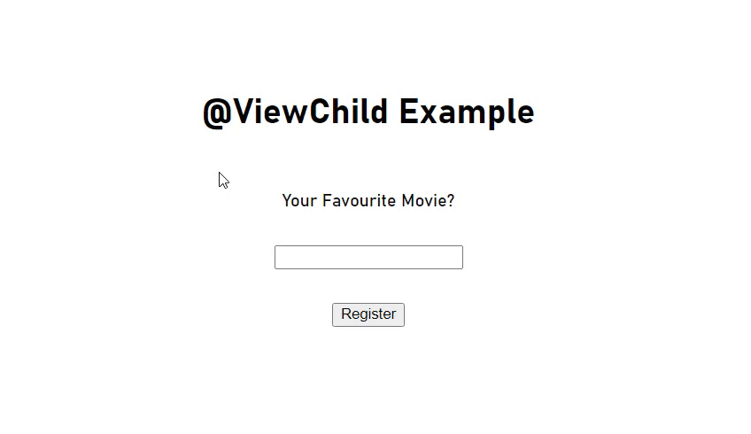

# view child

If you want to directly access and modify the dom from the component.ts(not passing into component.ts from html), you can use @ViewChild('selector')

Delcare the variable in component.ts

Local reference the element that u need access and add a button click event binding

Using @ViewChild('reference'), you now have access to the element.

