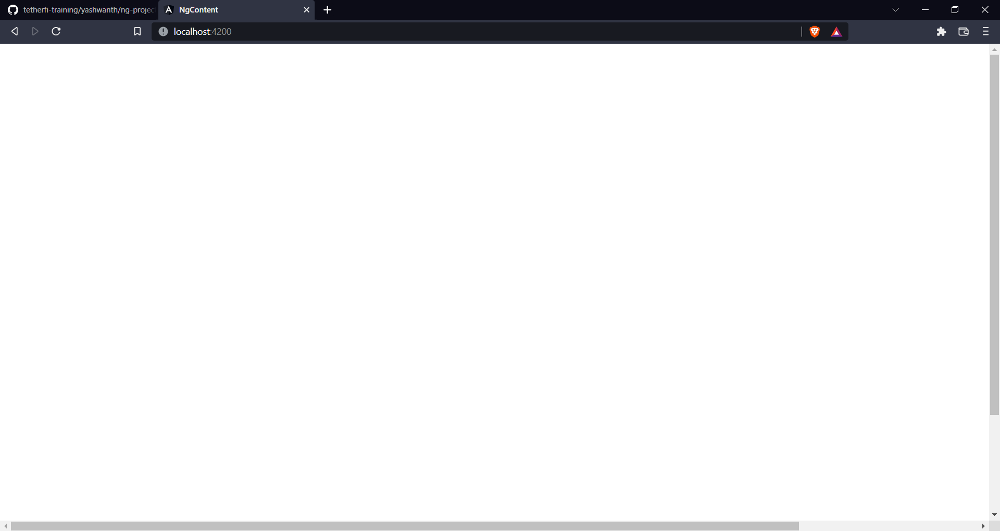

# ng-content

The ng-content tag is used for content projection. It is basically a placeholder to hold the dynamic content until it is parsed. Once the template is parsed, Angular replaces the tag with content.

Create a component.

Declare it in the app component. Add some paragraph inside the samele component selector.

It won't get projected in DOM. Anything inside the open and end tag of our component are simply ignored by angular.

But, u can make that happen by injecting ng-content inside the sample component.

And there u go!
